# creedengo-cheatsheet

The goal of this repository is to help you to use Creedengo.

To use Creedengo, you need to install and activate it. 

Let's see how to do it 👇

- [1. What is Creedengo ?](#1-what-is-creedengo-)
- [2. Installation](#2-installation)
  - [2.1. How to check if Creedengo is already installed?](#21-how-to-check-if-creedengo-is-already-installed)
    - [As administrator](#as-administrator)
    - [As user](#as-user)
  - [2.2. How to install Creedengo?](#22-how-to-install-creedengo)
- [3. Activation](#3-activation)
  - [3.1. How to check if Creedengo rules are already activated?](#31-how-to-check-if-creedengo-rules-are-already-activated)
  - [3.2. How to activate Creedengo?](#32-how-to-activate-creedengo)

## 1. What is Creedengo ?

Creedengo is a SonarQube plugin that helps you to detect bad ecodesign practices in your code.

To find out more:
- https://github.com/green-code-initiative
- https://green-code-initiative.org/

## 2. Installation

### 2.1. How to check if Creedengo is already installed?

#### As administrator
Go to `Administration` > `Marketplace` > `Installed`.

Search `creedengo`. If a result appears: the plugin is already installed.

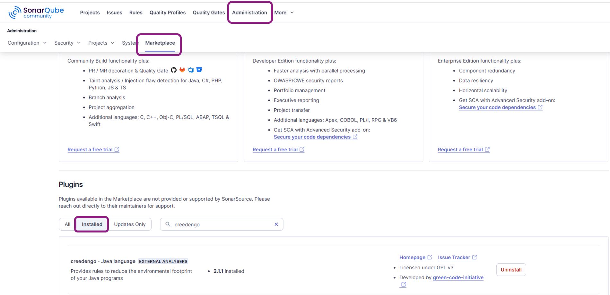

#### As user
Go to `Rules` > `Tags`.

Search the tag `creedengo`. If a result appears: the plugin is already installed.

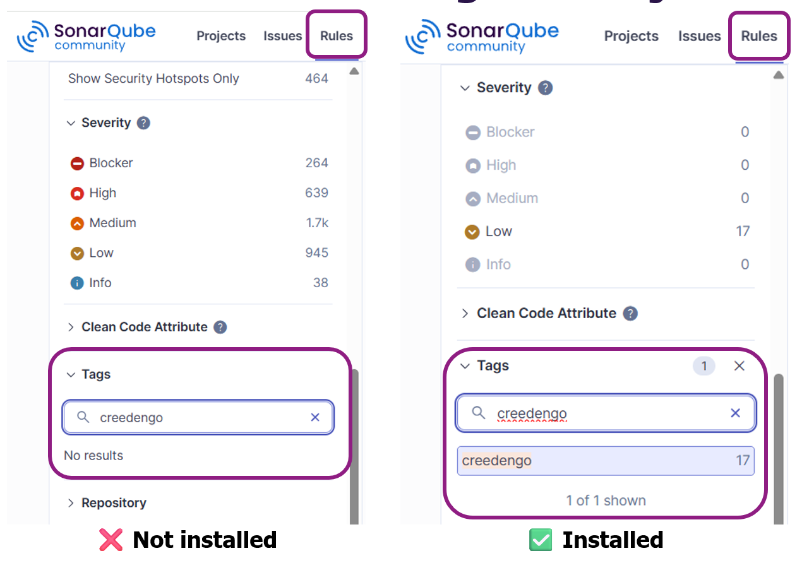

### 2.2. How to install Creedengo?
Prerequisite: you must be an administrator to install Creedengo plugins.

Go to `Administration` > `Marketplace` > `All`.

Search the tag `creedengo`: a plugin appears for each language.

Click the "Install" button for each plugin you wish to install.

A restart of your SonarQube instance will be required.

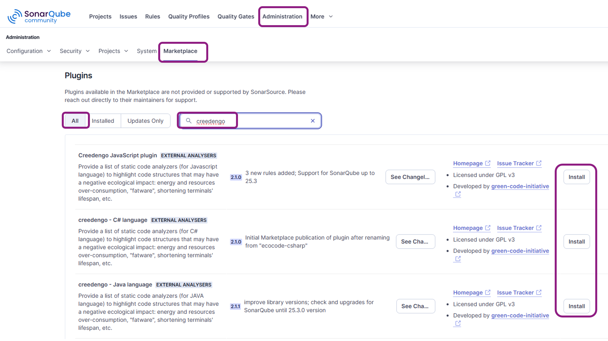

## 3. Activation

### 3.1. How to check if Creedengo rules are already activated?

**Step 1**: First, you need to identify which quality profile your project uses.

Go to your project and click on `Project Informations`:

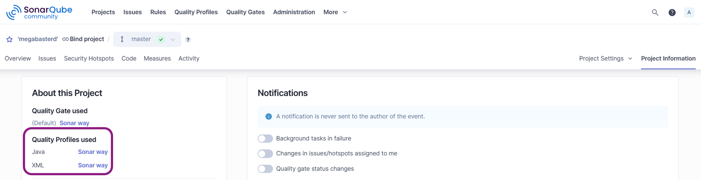

**Step 2**: Click on the quality profile used. Then, click on `activated rules`:

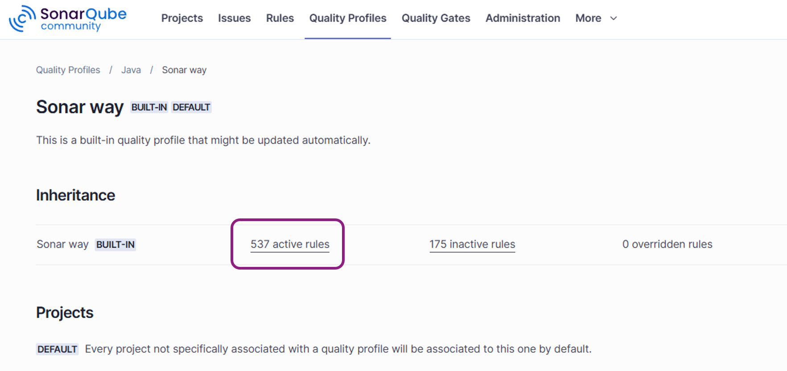

**Step 3**: Search the tag `creedengo`. If a result appears: the plugin is already activated.

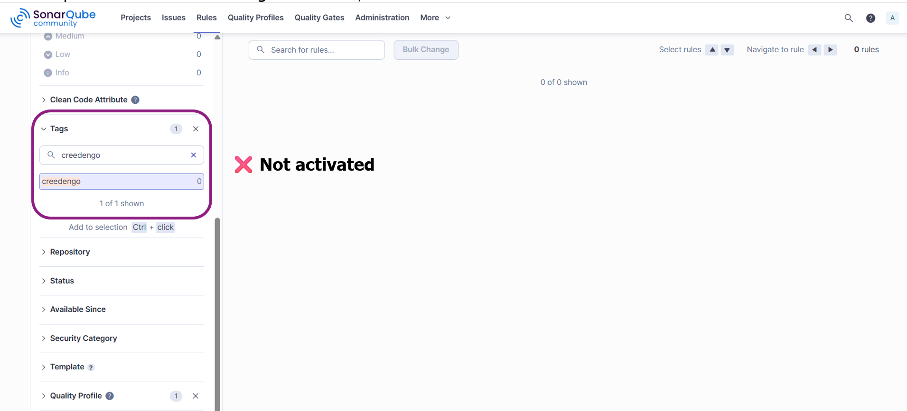.

In this capture: creedengo is not activated.

### 3.2. How to activate Creedengo?
Prerequisite: you must be an administrator to activate Creedengo plugins.

Afterwards, we assume that a new quality profile needs to be created. However, you can directly modify an existing quality profile as long as it is not the default quality profile (`Sonar Way`).

**Step 1**: Go to `Quality Profiles` click on `Create` and name your new quality profile:

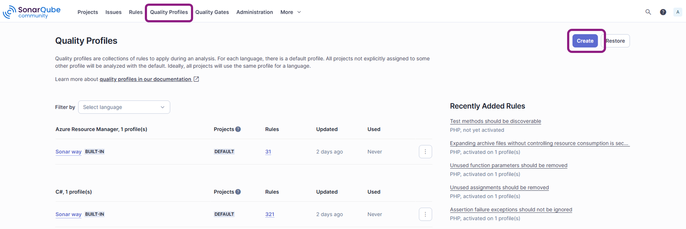

**Step 2**: Select `Extend an existing quality profile`, your language, the parent quality profile and a name:

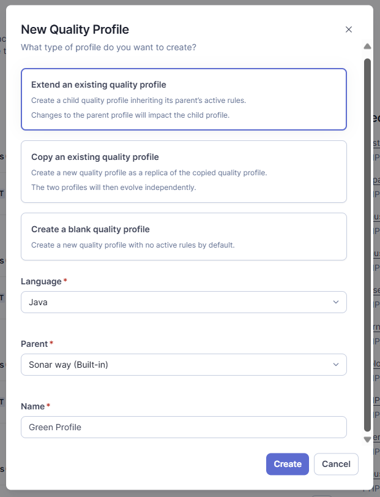

**Step 3**: Click on  `inactive rules` of the new quality profile:

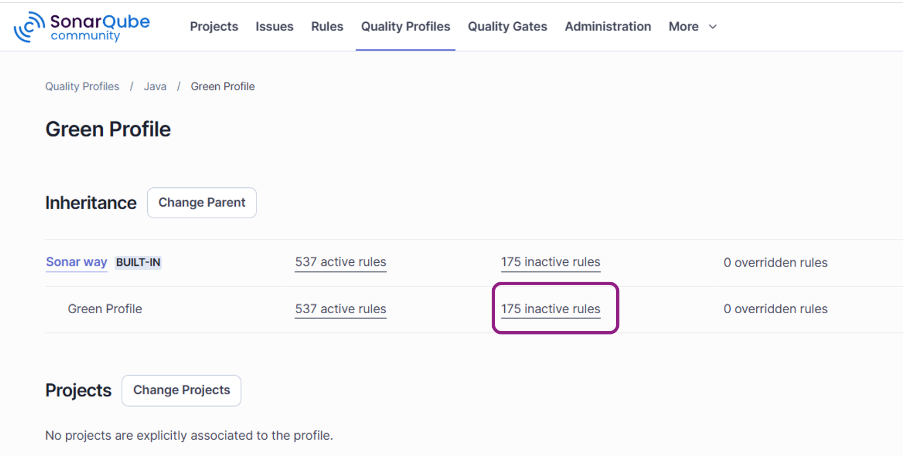

**Step 4**: Select the tag `creedengo`. Then, click on  `Bulk Change` > `Activate in [your new quality profile]`: this enables all rules.

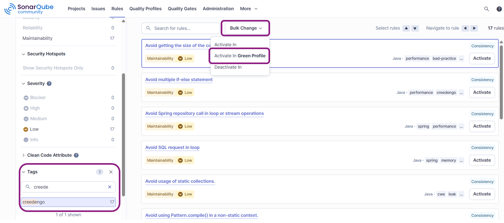

**Step 5**: Associate the new quality profile to your project: 

Click on `Change project` button:

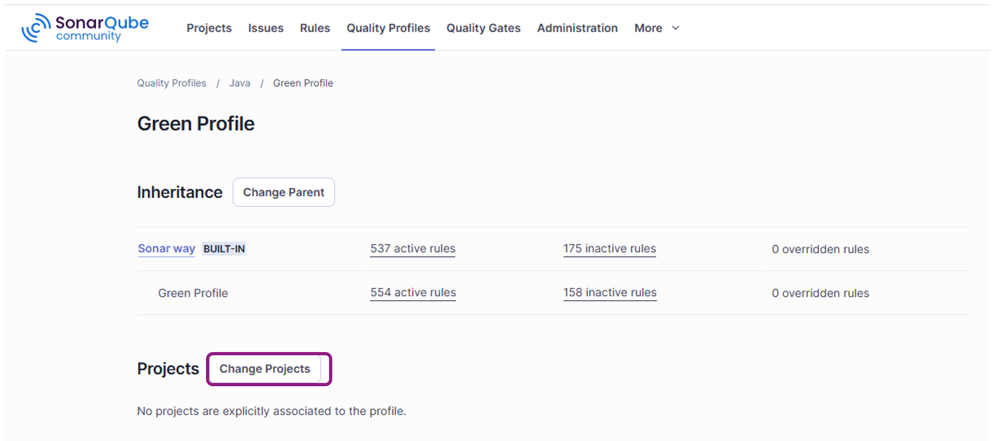

Select your project, and click on `Close` button. You should get this:

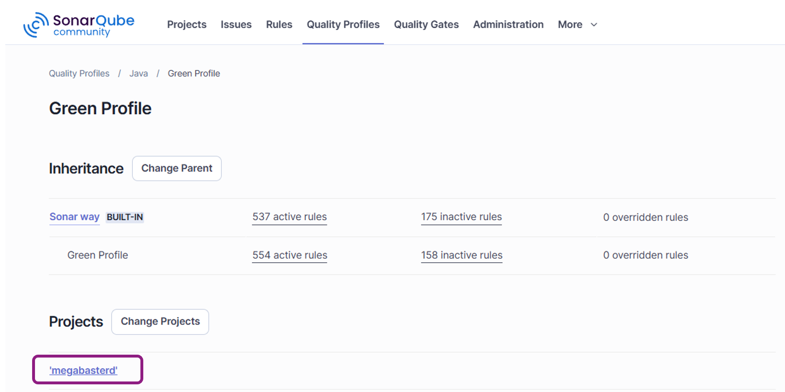
